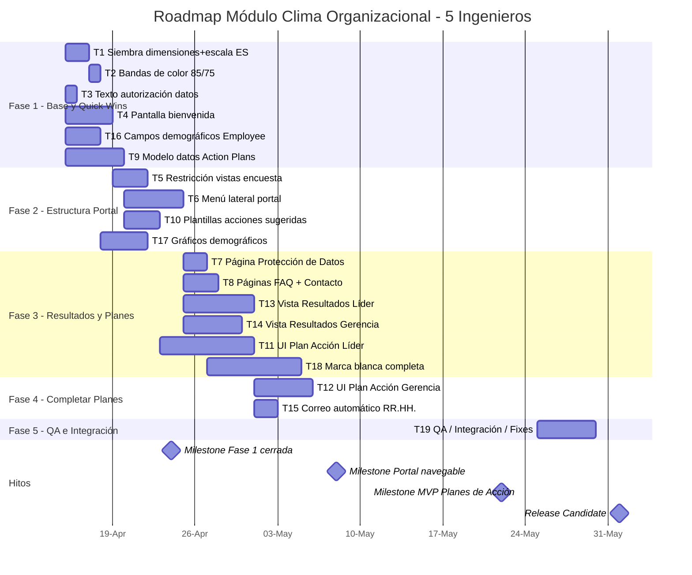

# Análisis de Requerimientos — Módulo de Encuesta de Clima

**Proyecto:** PeerHub / Kultiva
**Fecha del análisis:** 2026-04-15
**Documentos fuente:** Brochure Encuesta de Clima Kultiva + Levantamiento de Requerimientos Plataforma
**Capacidad asignada:** 5 ingenieros full-time

---

## 1. Resumen Ejecutivo

El módulo actual de Clima Organizacional cubre aproximadamente el **40% de los requerimientos** descritos en los documentos fuente. La base técnica existe (modelos de datos, distribución de encuestas, recolección de respuestas, dashboard de resultados para administradores), pero faltan componentes clave orientados al usuario final (colaboradores y líderes) y el módulo completo de **Planes de Acción**, que constituye el diferenciador principal del producto según el brochure.

**Esfuerzo total estimado:** ~60 días-ingeniero distribuidos en 16 ítems.
**Duración con 5 ingenieros en paralelo:** ~7 semanas (de 2026-04-15 al 2026-06-03).

---

## 2. Estado Actual del Módulo

### 2.1 Funcionalidades Soportadas

| Área | Ubicación |
|---|---|
| Creación y distribución de encuestas de clima | `src/lib/actions/climate-surveys.ts`, `climate-distribution.ts` |
| Dimensiones personalizables por tenant | Modelo `ClimateDimension`, `climate-dimensions.ts` |
| Tipos de pregunta (LIKERT, TEXT, NPS, RATING) | Modelo `SurveyQuestion` |
| Recolección de respuestas anónimas | Campo `ClimateSurvey.anonymous` |
| Dashboard administrativo con % por dimensión | `src/app/(dashboard)/surveys/climate/[id]/results/page.tsx` |
| Mapa de calor por departamento / equipo / hub | `climate-reports.ts` |
| Marca blanca básica (logo + color primario) | Campos `Company.logo`, `Company.primaryColor` |
| Notificaciones por correo (360) | `src/lib/email/templates.ts` |

### 2.2 Parcialmente Soportado

- **Escala de respuesta:** El sistema soporta escalas 1–5, 1–4 y 1–10. El brochure requiere específicamente la escala de 4 puntos en español: *Nunca / Casi nunca / Casi siempre / Siempre*.
- **12 dimensiones canónicas:** Las dimensiones son configurables pero no se siembran por defecto las 12 del brochure (Liderazgo, Calidad de Vida, Compromiso, Seguridad Psicológica, Comunicación, Diversidad e Inclusión, Ética e Integridad, Seguridad y Estabilidad, Gestión del Cambio, Cultura Organizacional, Flexibilidad y Autonomía, Salud Mental).
- **Rangos de color:** Existen bandas (actualmente 80/60) pero difieren de la especificación del brochure (85/75).
- **Segmentación demográfica:** El modelo `Employee` no captura género ni fecha de nacimiento (necesarios para los gráficos de participación por género y generación).

### 2.3 No Implementado

1. Pantalla de bienvenida con texto de confidencialidad y botón "Comenzar encuesta"
2. Texto de autorización de tratamiento de datos
3. Menú lateral del portal (8 secciones requeridas)
4. Vista de **Resultados Líder** (acceso por líder a su propio equipo)
5. Vista de **Resultados Gerencia** (vista ejecutiva org-wide + por líder)
6. Módulo completo de **Planes de Acción** (líder y gerencia)
7. Correo automático a RR.HH. cuando un líder completa todos sus planes
8. Restricción de vistas durante la etapa de encuesta
9. Páginas de Preguntas Frecuentes y Contacto en el portal
10. Sistema completo de marca blanca (temas por tenant)
11. Siembra de las 12 dimensiones + escala de 4 puntos en español
12. Ajuste de bandas a 85/75

---

## 3. Desglose de Tareas y Estimaciones

| # | Tarea | Responsable | Esfuerzo | Dependencias |
|---|---|---|---|---|
| T1 | Siembra de 12 dimensiones + escala 4 puntos ES | 1 ing | 2d | — |
| T2 | Ajuste de bandas de color a 85/75 | 1 ing | 0.5d | T1 |
| T3 | Texto de autorización de datos personales | 1 ing | 1d | — |
| T4 | Pantalla de bienvenida del portal | 1 ing | 4d | — |
| T5 | Restricción de vistas durante fase de encuesta | 1 ing | 3d | T4 |
| T6 | Menú lateral del portal (estructura + rutas) | 1 ing | 5d | — |
| T7 | Página de Protección de Datos | 1 ing | 2d | T6 |
| T8 | Páginas FAQ + Contacto | 1 ing | 3d | T6 |
| T9 | Modelo de datos Action Plans (schema, queries, acciones) | 1 ing | 5d | — |
| T10 | Plantillas de acciones sugeridas (4 por dimensión × 12) | 1 ing | 3d | T9 |
| T11 | UI Plan de Acción Líder (heatmap + formulario + personalización) | 1 ing | 8d | T9, T10 |
| T12 | UI Plan de Acción Gerencia (políticas/estrategias) | 1 ing | 5d | T9, T10 |
| T13 | Vista de Resultados Líder (filtrado por equipo propio) | 1 ing | 6d | T6 |
| T14 | Vista de Resultados Gerencia (ejecutiva + por líder) | 1 ing | 5d | T6 |
| T15 | Correo automático a RR.HH. al completar planes | 1 ing | 2d | T11 |
| T16 | Campos demográficos en Employee (género, fecha nacimiento) | 1 ing | 3d | — |
| T17 | Gráficos de participación por género / generación / antigüedad | 1 ing | 4d | T16 |
| T18 | Sistema completo de marca blanca (temas por tenant) | 1 ing | 8d | — |
| T19 | QA / Integración / Fixes | Todo el equipo | 5d | Todas |

**Total:** ~74 días-ingeniero (con QA).

---

## 4. Plan de Implementación — Gantt

---

## 5. Asignación de Recursos (5 Ingenieros)

### Semana 1 (15–19 abril)

| Ingeniero | Tareas |
|---|---|
| Ing 1 | T1 Siembra dimensiones → T2 Bandas color |
| Ing 2 | T3 Texto autorización → T4 Pantalla bienvenida |
| Ing 3 | T16 Campos demográficos → T17 Gráficos demográficos (inicio) |
| Ing 4 | T9 Modelo datos Action Plans |
| Ing 5 | T6 Menú lateral portal (arranque) |

### Semana 2–3 (20 abril – 3 mayo)

| Ingeniero | Tareas |
|---|---|
| Ing 1 | T5 Restricción vistas encuesta → T7 Protección Datos |
| Ing 2 | T13 Vista Resultados Líder |
| Ing 3 | T17 Gráficos demográficos → T14 Vista Resultados Gerencia |
| Ing 4 | T10 Plantillas acciones → T11 UI Plan Líder (inicio) |
| Ing 5 | T6 Menú lateral portal → T8 FAQ + Contacto |

### Semana 4–5 (4–17 mayo)

| Ingeniero | Tareas |
|---|---|
| Ing 1 | T18 Marca blanca completa |
| Ing 2 | T14 Vista Resultados Gerencia (continuación) |
| Ing 3 | T18 Marca blanca (apoyo frontend) |
| Ing 4 | T11 UI Plan Líder (continuación) |
| Ing 5 | T12 UI Plan Gerencia |

### Semana 6 (18–24 mayo)

| Ingeniero | Tareas |
|---|---|
| Ing 1 | T18 Marca blanca (cierre) + inicio de QA |
| Ing 2 | T15 Correo automático RR.HH. + QA |
| Ing 3 | QA |
| Ing 4 | T11 UI Plan Líder (cierre) + QA |
| Ing 5 | T12 UI Plan Gerencia (cierre) + QA |

### Semana 7 (25 mayo – 1 junio)

Todos: **T19 QA, integración, bug fixes y release candidate.**

---

## 6. Hitos Clave

| Hito | Fecha | Descripción |
|---|---|---|
| **M1 — Fase 1 cerrada** | 2026-04-24 | Dimensiones sembradas, bienvenida funcional, modelo de planes listo |
| **M2 — Portal navegable** | 2026-05-08 | Menú lateral + todas las páginas base + resultados por rol |
| **M3 — MVP Planes de Acción** | 2026-05-22 | Flujo completo líder + gerencia, correo a RR.HH. |
| **M4 — Release Candidate** | 2026-06-01 | QA completo, marca blanca lista, listo para piloto |

---

## 7. Riesgos y Consideraciones

### Riesgos técnicos

- **Permisos y aislamiento por rol:** Las vistas de Resultados Líder y Gerencia requieren lógica de filtrado robusta. Riesgo de fuga de datos entre equipos si el aislamiento no se prueba exhaustivamente.
- **Anonimato vs. segmentación:** El umbral mínimo de respuestas (actualmente 3) debe respetarse en toda segmentación demográfica para evitar identificación individual.
- **Marca blanca:** Puede tener alcance mayor al estimado si se incluyen fuentes personalizadas, favicons y emails con identidad del cliente.

### Riesgos de producto

- **Plantillas de acciones sugeridas:** Las 48 acciones sugeridas (4 × 12 dimensiones) deben ser redactadas por el equipo de contenido / consultoría, no por ingeniería. Si no están listas a tiempo se convierte en bloqueante para T11.
- **Nuevas versiones de planes (mencionadas en el documento como "Revisar con Laura"):** Hay una versión evolucionada de planes pendiente de definir. Se recomienda congelar alcance de V1 antes de iniciar T11.

### Dependencias externas

- Disponibilidad de contenido (acciones sugeridas, textos legales, FAQ)
- Validación de diseño con el cliente (look & feel por tenant)
- Revisión jurídica del texto de autorización de datos

---

## 8. Próximos Pasos Recomendados

1. **Esta semana:** congelar alcance V1 de Planes de Acción y asignar redactor de las 48 acciones sugeridas.
2. **Esta semana:** validar con jurídico el texto exacto de autorización de datos.
3. **Esta semana:** kick-off con los 5 ingenieros y asignación formal de tickets.
4. **Antes del 2026-05-08:** entorno de staging listo para pruebas con un cliente piloto.
5. **Antes del 2026-06-01:** sesión de QA exploratoria con equipo de Kultiva + cliente piloto.
